### BASIC LINUX COMMANDS

**1. &emsp;`whoami`:** This is used to get information about the current logged in user.  
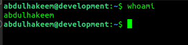

**2. &emsp; `pwd`:** This is used to get information about your current working directory.  
As a Linux user, you'll be working with the terminal more than GUI, so it is essential to always keep track of where you are, so that you don't mess things up on your system.  
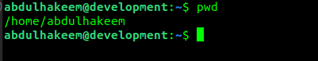

**3. &emsp; `cd`:** This is used to change from one directory to another.  
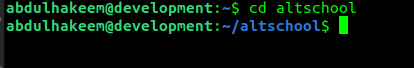

**4. &emsp; `touch`:** This is used to create a new file.  
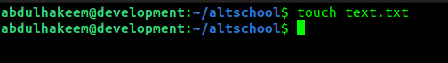

**5 &emsp; `ls`:** This is used to list contents of a directory.  
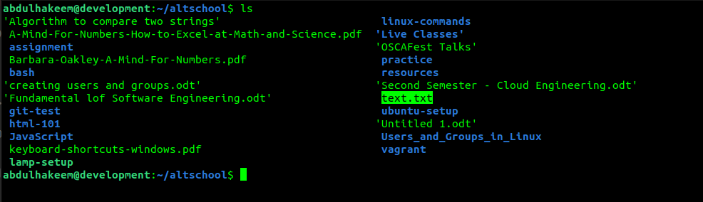  
As you can see, the new file `text.txt` which I just created is now in the directory.

**6 &emsp; `rm`:** This is used to delete a file or directory.  
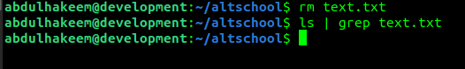  
I just deleted the new file `text.txt` and when I did `ls` again, the file was no longer there.

**7 &emsp; `mkdir`:** This is used to create a new directory.  
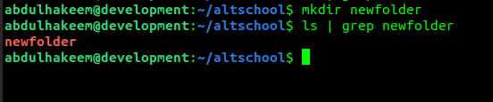  
I created a new directory called `newfolder`.

**8 &emsp; `mv`:** This is used to rename a file or directory. You can also move a file or directory between directories using the `mv` command.  
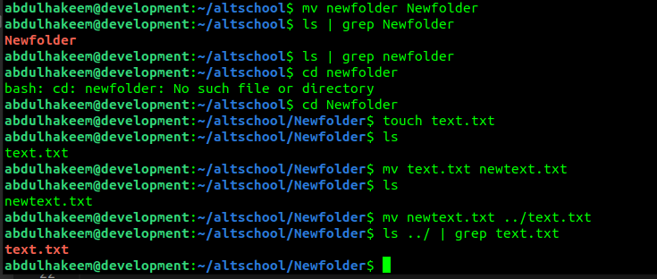  
First, I renamed the directory `newfolder` to `Newfolder`. A very important concept I want to call your attention to here is Linux case sensitivity. Linux is case sensitive, so `newfolder` is not `Newfolder` on Linux system. You see, I did `ls | grep Newfolder` it appeared, but when I did `ls | grep newfolder` nothing appears because the file has been renamed. Also when I did `cd newfolder` it says "no such file or directory".  
I also, created a new file `text.txt` and then renamed it to `newtext.txt`.
Then, I moved the file `newtext.txt` to another directory (The parent directory) and renamed it to `text.txt`. Remember I deleted the old file `text.txt` in the parent directory, so what I have here is the one I just moved into the directory.

**9 &emsp; `cp`:** This is used to copy file within a directory or from one directory to another.  
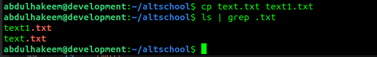

**10 &emsp; `cat`:** This is used to view the contents of a file.  
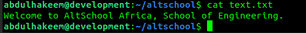  
I added a line of text in the `text.txt` file that I created earlier, and I was able to view the contents using the `cat` command.

**11 &emsp; `echo`:** This is used to display strings that are passed to it as arguments.  
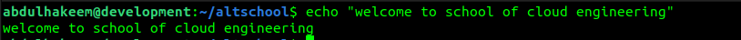  
The echo command also accept variables as arguments, like this:  
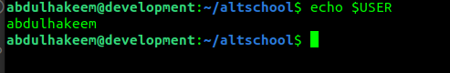  
and it can also be used to pass stings to a file, like this:  
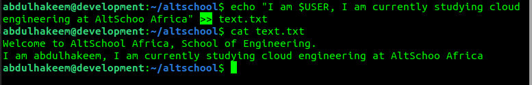  
Here, I used the `echo` command to append a new line of text to my `test.txt` file using a redirection `>>` symbol.

**12 &emsp; `more`:** This is used to view the contents of a file in a page form. Unlike `cat` command which outputs all the contents to your terminal at once.  
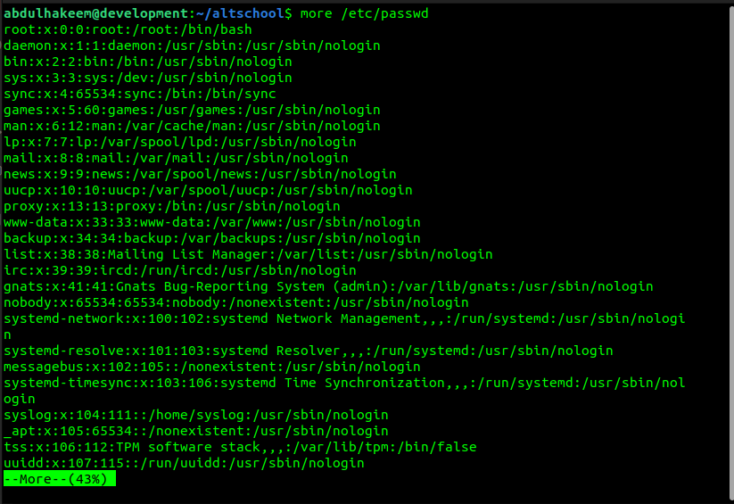

**13 &emsp; `less`:** This is used to view the contents of a file (one page at a time). It is similar to the `more` command, but faster in rendering the contents when compared with `more` command. Also, it does not leave the contents of the file on terminal like `more`  
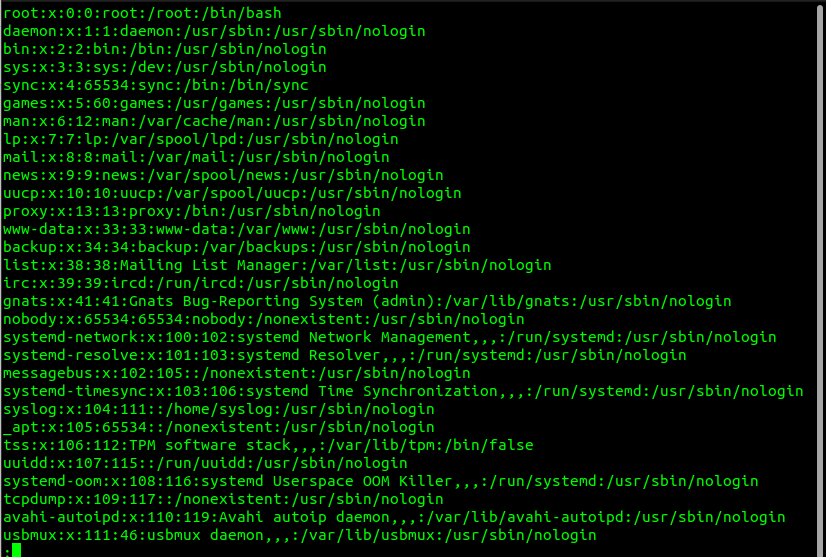

**14 &emsp; `head`:** This is used to view the first n numbers of lines in a file. When no option is specified, by default it outputs the first 10 lines in a file.  
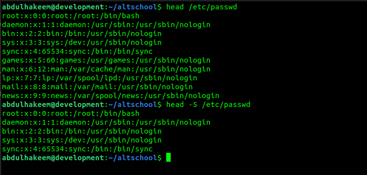  
Here, I used the `head` command without any option, and I got the first 10 line of the file, then I used it the second time and passed `-5` option to it, it gave me the first 5 lines on the file.

**15 &emsp; `tail`:** This is used to view the last n numbers of lines in a file.  
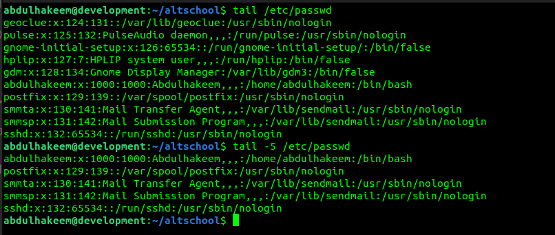  
`tail` command works similarly to `head` command but in opposite direction.

**16 &emsp; `rmdir`:** This is used to delete a directory.  
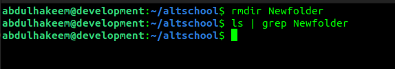

**17 &emsp; `man`:** This is used to view the manual page of a command.  
Almost every command in Linux has its manual page that contains the usage syntax, acceptable arguments and options that are available for such command.  
It is good to always check the man page of a command to have a better understanding of its usage.  
  
  
  
  

**18 &emsp; `sed`**  
**19 &emsp;`df`**  
**20 &emsp; `date`**  
**21 &emsp; `chmod`**  
**22 &emsp; `useradd`**  
**23 &emsp; `usermod`**  
**24 &emsp; `groupadd`**  
**25 &emsp; `groupmod`**  
**26 &emsp; `passwd`**  
**27 &emsp; `su`**  
**28 &emsp; `sudo`**  
**29 &emsp; `ps`**  
**30 &emsp; `top`**
